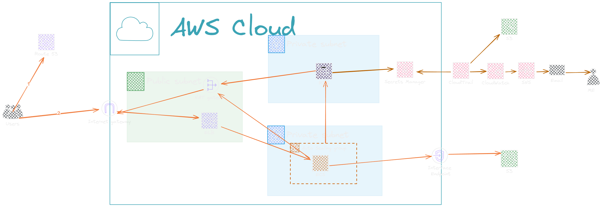

# **Terraform AWS Nextcloud**

This project sets up **Nextcloud** on **AWS** using **Terraform** to provide secure, scalable, and private cloud storage. The infrastructure is based on **Infrastructure as Code (IaC)** principles, enabling modular and efficient cloud resource provisioning.

## Infrastructure Architecture


## Key Features

### Monitoring & Security

- **CloudWatch**: Monitors **CloudTrail** logs for any API calls related to sensitive data, such as accessing secrets from **Secrets Manager**.
- **CloudTrail**: Tracks all API activity within your AWS environment, providing an **audit trail** for security and compliance.
- **SNS**: If a secret is accessed, **CloudWatch** triggers an alarm and sends an email notification via **SNS** to alert administrators of potential security breaches.
- **Secrets Manager**: Securely stores credentials and sensitive information, ensuring they are encrypted and protected from unauthorized access.

### Scalability & Availability

- **Auto Scaling Group**: Automatically adjusts the number of **ECS** instances based on traffic, ensuring that the system can handle varying workloads without manual intervention.
- **Elastic Load Balancer (ELB)**: Distributes incoming traffic across multiple **EC2** instances, improving the **availability** and **fault tolerance** of the application.
- **ECS (Elastic Container Service)**: Runs the **Nextcloud** containers and ensures that the application can scale horizontally by adding or removing containers as needed.

### Data Storage

- **EFS (Elastic File System)**: Provides scalable, distributed file storage that can be accessed by **ECS** containers, allowing **Nextcloud** to store and share files seamlessly across instances.
- **S3**: Serves as the object storage for **Nextcloud** files, offering high durability and scalability for storing user data.

### Overview

- **Security**: Uses **Secrets Manager** to securely store and manage credentials.
- **Scalability**: The infrastructure is designed to automatically scale using **Auto Scaling Groups** and **Elastic Load Balancer**.
- **Monitoring**: Integrated with **CloudWatch** and **CloudTrail** for infrastructure monitoring and event auditing.
- **Automated Deployment**: The entire infrastructure is deployed automatically using **Terraform**.

## Requirements

- [Terraform](https://www.terraform.io/) (This version has been tasted and is compatible with **Terraform v1.13.3** ).
- An **AWS** account with sufficient permissions to create the necessary infrastructure (EC2, RDS, S3, IAM, etc.).

## Getting Started

1. **Clone the Repository**:

   ```bash
   git clone https://github.com/NeroXrX/terraform-aws-nextcloud.git
   cd terraform-aws-nextcloud
   
2. **Configure Terraform**:    
    Before applying the changes, ensure your **AWS** credentials are configured correctly. If you're using the AWS CLI, run:

    ``` bash
   aws configure

4. **Initialize Terraform**:
    ```bash
    terraform init

5. **Verify the Execution Plan**:
    Before applying the infrastructure, you can review the changes Terraform will make with:
    ```bash
   terraform plan

6. **Apply the Infrastructure**:
    To create the infrastructure on **AWS**, run:
    ```bash
    terraform apply
    ```
    Terraform will ask for confirmation before proceeding.
    
7. **Destroy the Infrastructure**:
    If you want to destroy the created infrastructure, run:
    ```bash
    `terraform destroy`
    ```

## Contributing

Contributions are welcome! If you'd like to contribute to this project, please follow these steps:
Fork the repository.

1.- Create a new branch (git checkout -b feature/new-feature).

2.- Make your changes and commit them (git commit -am 'Add new feature').

3.- Push to the branch (git push origin feature/new-feature).

4.- Create a Pull Request.


